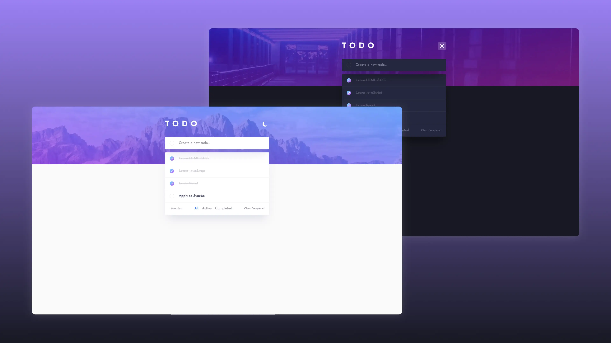

# React ToDo App

This repository contained the implementation of a todo list application using React. The project was created with Vite, used Formik for forms, Axios for HTTP requests, and styled-components with CSS modules. The application had several key functionalities, which are summarized below:

## Functionality Summary

- ✅ View the optimal layout for the app depending on the device's screen size
- ✅ See hover states for all interactive elements on the page
- ✅ Add new todos to the list
- ✅ Mark todos as complete
- ✅ Delete todos from the list
- ✅ Filter by all/active/complete todos
- ✅ Clear all completed todos

## Live Demo

- **Source Files**: [GitHub Repository](https://github.com/grifano/fm-todo-app)
- **Working Page**: [Live Preview](https://fm-todo-app-two.vercel.app/)

## Project Setup

1.  Clone the repository.
2.  Install dependencies: `npm install`
3.  Start the development server: `npm run dev`

<!-- ## Code Quality

- Ensured no errors or warnings in the console.
- Maintained clean and understandable JavaScript code using Prettier for formatting. -->

<!-- ## Component List

- `App`: The root component containing the main structure.
- `SearchBar`: Component with a form to search for images.
- `ImageGallery`: Component to display a list of image cards.
- `ImageCard`: Individual image item within the gallery.
- `Loader`: Loading spinner displayed during image fetch.
- `ErrorMessage`: Displayed when an error occurred during image fetch.
- `LoadMoreBtn`: Button to load more images.
- `ImageModal`: Modal window to display an enlarged version of the image. -->

## Acknowledgments

- Synebo - [www.synebo.io](https://www.synebo.io/)
- Frontend Mentor -
  [www.frontendmentor.com](https://www.frontendmentor.io/profile/grifano)

<!-- 

[GOIT](https://edu.goit.global/uk/referral?x=eyJlbWFpbCI6InNvcmxlbmtAZ21haWwuY29tIiwiZmlyc3ROYW1lIjoi0KHQtdGA0LPRltC5IiwibG9jYWxlIjoidWsiLCJsYW5ndWFnZSI6InVrIiwidG90YWxIb3VycyI6NzcsImN1cnJlbnRPckxhc3RUZWNobm9sb2d5IjoiSFRNTF9DU1MiLCJwYXNzZWRIb21ld29ya3NDb3VudCI6NX0=) -
big love to GoIT team for their patience, afford, help, and positivity that they
share with us ❤️ -->

## Author

- Website - [www.grifano.com](https://grifano.com)
- Frontend Mentor -
  [www.frontendmentor.com](https://www.frontendmentor.io/profile/grifano)
- LinkedIn - [www.linkedin.com](https://www.linkedin.com/in/grifano/)
